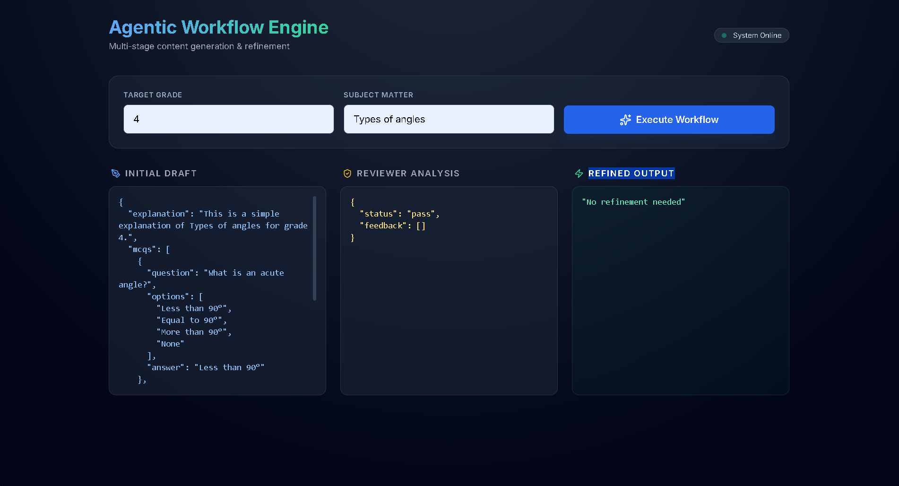

# 🤖 AI Agent-Based Educational Content Generator

## 📌 Overview

This project implements a simple agent-based system with:

* Generator Agent (creates educational content)
* Reviewer Agent (evaluates content quality)
* Refinement logic (improves output if needed)

## ⚙️ Tech Stack

* FastAPI (Backend)
* HTML + Tailwind (Frontend)
* Python (Core Logic)

## 🔄 Workflow

User Input → Generator → Reviewer → (Refine if needed)

## 🚀 How to Run

### Backend

```bash
python -m uvicorn backend.main:app --reload
```

### Frontend

Open:
frontend/index.html

## 🧠 Features

* Structured JSON output
* Rule-based evaluation
* Clean UI dashboard
* Retry mechanism

## 📸 Demo




## 👨‍💻 Author

Jayant Bansal
